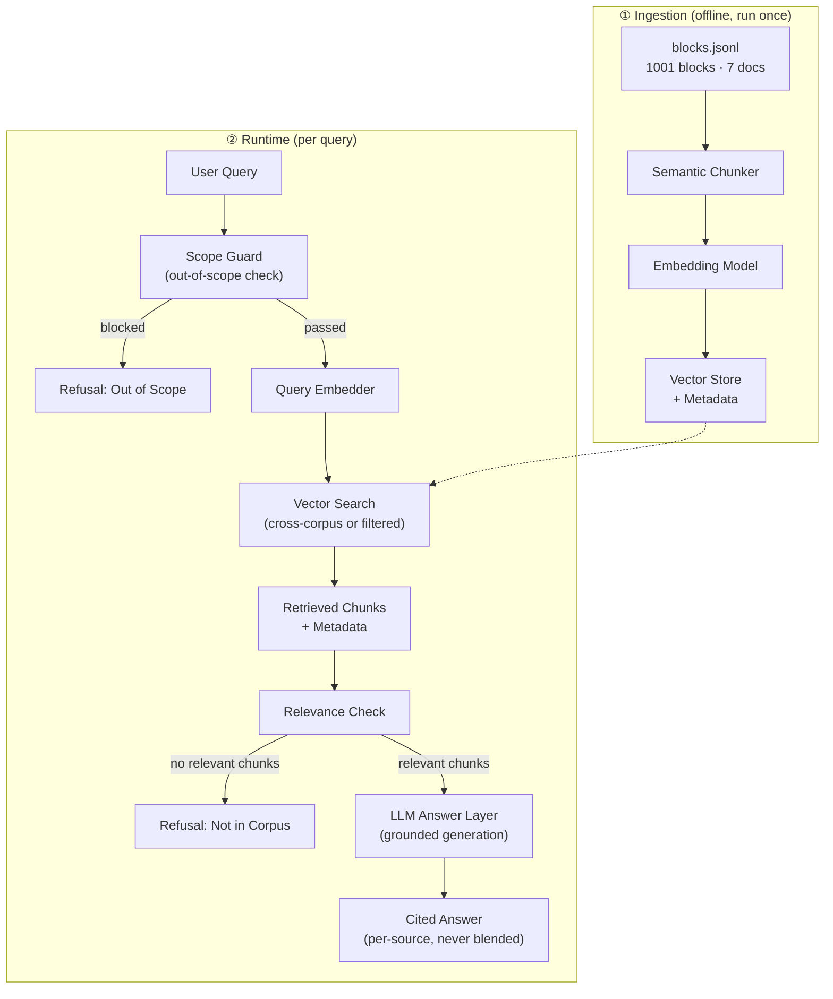
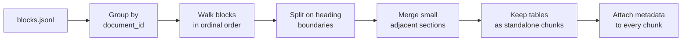
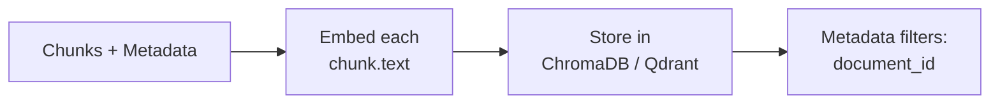
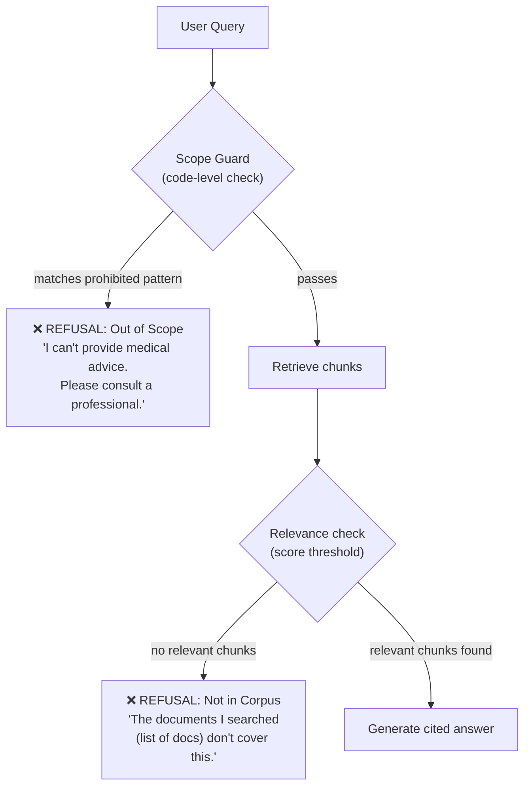
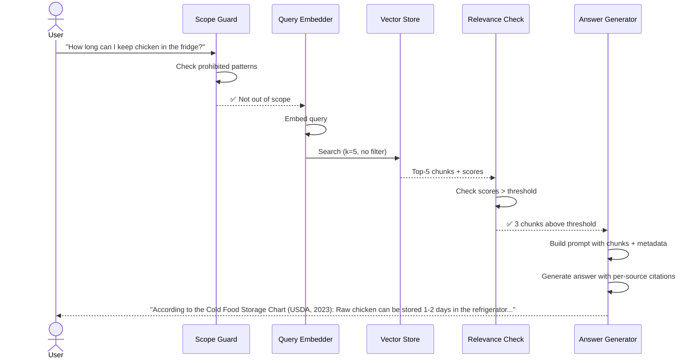

# Architecture — Dietary Guidance RAG Chatbot

## 1. High-Level Overview



The system has two distinct phases:

| Phase | When it runs | What it does |
|---|---|---|
| **Ingestion** | Once, offline | Reads `blocks.jsonl`, chunks, embeds, stores |
| **Runtime** | Every user query | Guards → retrieves → generates cited answer or refuses |

---

## 2. Corpus & Data Source

### 2.1 Source File

The entire corpus lives in a single pre-parsed file:

```
blocks.jsonl          (1001 blocks, 7 documents)
```

Each line is a JSON object with this schema:

```json
{
  "document_id": "who-healthy-diet",
  "ordinal":     3,
  "type":        "list_item",
  "text":        "A healthy diet helps to protect against...",
  "heading_path": ["Healthy diet", "KEY FACTS"],
  "level":       null
}
```

| Field | Type | Purpose |
|---|---|---|
| `document_id` | string | Which document this block belongs to |
| `ordinal` | int | Block ordering within the document |
| `type` | `heading` · `paragraph` · `list_item` · `table` | Structural type of the block |
| `text` | string | The actual content |
| `heading_path` | string[] | Breadcrumb of section headings leading to this block |
| `level` | int \| null | Heading level (for heading blocks) |

### 2.2 Corpus Statistics

| Document | Blocks | Description |
|---|---|---|
| `kitchen-companion` | 469 | Comprehensive food safety reference |
| `who-five-keys` | 174 | WHO Five Keys to Safer Food |
| `eatwell-guide` | 120 | UK Eatwell dietary guidance |
| `fao-who-healthy-diets` | 98 | FAO/WHO healthy diets guidance |
| `who-healthy-diet` | 92 | WHO Healthy Diet fact sheet |
| `fsa-chill` | 45 | FSA chilling & refrigeration guidance |
| `cold-food-storage` | 3 | Cold food storage chart (mostly one large table) |

| Block type | Count |
|---|---|
| `list_item` | 430 |
| `paragraph` | 383 |
| `heading` | 176 |
| `table` | 12 |

Text length: **min 3 chars, max 5081 chars, median 106 chars, mean 167 chars**.

### 2.3 Document Metadata Registry

Since `blocks.jsonl` only carries `document_id`, a separate metadata mapping is needed to supply publisher, year, and source URL for citations:

```python
DOCUMENT_METADATA = {
    "cold-food-storage": {
        "title": "Cold Food Storage Chart",
        "publisher": "USDA / FoodSafety.gov",
        "year": 2023,
        "url": "https://www.foodsafety.gov/food-safety-charts/cold-food-storage-charts"
    },
    "eatwell-guide": {
        "title": "The Eatwell Guide",
        "publisher": "Public Health England / NHS",
        "year": 2016,
        "url": "https://www.nhs.uk/live-well/eat-well/the-eatwell-guide/"
    },
    "fao-who-healthy-diets": {
        "title": "Healthy Diets",
        "publisher": "FAO / WHO",
        "year": 2019,
        "url": "https://www.fao.org/documents/card/en/c/ca6640en"
    },
    "fsa-chill": {
        "title": "Chilling",
        "publisher": "Food Standards Agency (UK)",
        "year": 2023,
        "url": "https://www.food.gov.uk/safety-hygiene/chilling"
    },
    "kitchen-companion": {
        "title": "Kitchen Companion: Your Safe Food Handbook",
        "publisher": "USDA FSIS",
        "year": 2008,
        "url": "https://www.fsis.usda.gov/food-safety/safe-food-handling-and-preparation/food-safety-basics/kitchen-companion"
    },
    "who-five-keys": {
        "title": "Five Keys to Safer Food Manual",
        "publisher": "World Health Organization",
        "year": 2006,
        "url": "https://www.who.int/publications/i/item/9789241594639"
    },
    "who-healthy-diet": {
        "title": "Healthy Diet – Fact Sheet N°394",
        "publisher": "World Health Organization",
        "year": 2020,
        "url": "https://www.who.int/news-room/fact-sheets/detail/healthy-diet"
    }
}
```

> **Note:** Verify and adjust the URLs, years, and publisher names against the actual source documents before finalising.

---

## 3. Chunking Strategy

### 3.1 The Problem with Naïve Chunking

The blocks in `blocks.jsonl` are highly variable:
- **176 headings** that carry no standalone value but are critical context
- **12 tables** (some up to 5000 chars) that fixed-size splitting would destroy
- **430 list items** averaging ~100 chars — individually too small, but semantically grouped under headings
- **383 paragraphs** of varying length

A fixed-size splitter (e.g., 500 tokens with overlap) would cut tables in half, orphan list items from their headings, and produce chunks that lose their section context.

### 3.2 Chosen Approach: Semantic Section Chunking



**Algorithm:**

1. **Group** blocks by `document_id`, sorted by `ordinal`.
2. **Walk** blocks in order. Start a new chunk whenever a `heading` block appears (respecting `level` — a level-1 heading always starts a new chunk; lower-level headings start a new chunk only if the current chunk exceeds the minimum threshold).
3. **Accumulate** `paragraph` and `list_item` blocks into the current chunk, preserving their text in order.
4. **Tables stay intact** — a `table` block always becomes its own chunk (or is appended to the current chunk if it is short). Never split a table across chunks.
5. **Merge undersized chunks** — if a chunk has fewer than ~100 characters of content, merge it into the next chunk.
6. **Cap oversized chunks** — if a chunk exceeds ~1500 characters, split at paragraph boundaries (never mid-sentence, never mid-table).

### 3.3 Chunk Schema

Every chunk produced by the chunker carries:

```json
{
  "chunk_id": "eatwell-guide__sugars__003",
  "document_id": "eatwell-guide",
  "section_heading": "How much sugar is too much?",
  "heading_path": ["The Eatwell Guide", "Sugar", "How much sugar is too much?"],
  "text": "Adults should have no more than 30g of free sugars a day...",
  "block_types": ["paragraph", "list_item"],
  "ordinal_range": [68, 74],
  "char_count": 487,
  "metadata": {
    "title": "The Eatwell Guide",
    "publisher": "Public Health England / NHS",
    "year": 2016,
    "url": "https://www.nhs.uk/live-well/eat-well/the-eatwell-guide/"
  }
}
```

### 3.4 Configuration Defaults

| Parameter | Value | Rationale |
|---|---|---|
| Min chunk size | 100 chars | Avoids orphaned headings |
| Target chunk size | 500–800 chars | Balances retrieval precision vs. context |
| Max chunk size | 1500 chars | Prevents dilution of embedding signal |
| Overlap | 0 (section-based, not sliding window) | Heading-based splits have natural boundaries |
| Table handling | Always standalone | Tables are semantically self-contained |

---

## 4. Embedding & Vector Store

### 4.1 Embedding Model

| Option | Dimensions | Cost | Recommendation |
|---|---|---|---|
| `BAAI/bge-large-en-v1.5` | 1024 | Free, local | **Default choice** — state-of-the-art open-source embeddings, no API key |
| `text-embedding-3-small` (OpenAI) | 1536 | Paid API | Higher quality, requires API key |
| Cohere `embed-english-v3.0` | 1024 | Paid API | Strong alternative |

**Recommendation:** Start with `BAAI/bge-large-en-v1.5` for high-quality local embeddings. Swap to OpenAI if retrieval hit rate is below target.

### 4.2 Vector Store



| Option | Type | Pros | Recommended for |
|---|---|---|---|
| **ChromaDB** | Embedded (local) | Zero config, Python-native, metadata filtering | Prototyping (default) |
| **Qdrant** | Self-hosted or cloud | Production-grade, fast filtered search | Production |
| **Supabase pgvector** | Hosted Postgres | SQL interface, integrates with existing backend | If using Supabase already |

**Recommendation:** Use **ChromaDB** for the prototype — it runs in-process, supports metadata filtering (needed for per-document retrieval), and requires no external services.

### 4.3 Index Operations

```python
# Cross-corpus search (all documents)
results = collection.query(
    query_embeddings=[query_embedding],
    n_results=k
)

# Filtered search (single document)
results = collection.query(
    query_embeddings=[query_embedding],
    n_results=k,
    where={"document_id": "who-healthy-diet"}
)
```

### 4.4 Retrieval Parameters

| Parameter | Value | Notes |
|---|---|---|
| `k` (top results) | 5 | Tune based on question bank hit rate |
| Distance metric | Cosine similarity | Standard for sentence-transformers |
| Score threshold | 0.3 (tentative) | Chunks below this are treated as irrelevant |

---

## 5. Guardrails & Refusal Logic

### 5.1 Two Refusal Types



### 5.2 Out-of-Scope Guard (Code-Level — runs BEFORE retrieval)

This is a **hard-coded guardrail**, not a prompt instruction. It runs before any retrieval or LLM call.

```python
PROHIBITED_PATTERNS = [
    # Medical advice
    r"\b(diagnos|prescri|medication|treatment|symptom|disease|cure)\b",
    # Calorie / weight targets
    r"\b(calorie target|caloric target|how many calories|lose weight|gain weight)\b",
    r"\b(BMI|body mass index|ideal weight|target weight|weight goal)\b",
    # Personal medical
    r"\b(should I take|am I sick|do I have|my doctor)\b",
]

def is_out_of_scope(query: str) -> bool:
    """Hard-coded guardrail. Returns True if query is in a prohibited category."""
    query_lower = query.lower()
    return any(re.search(p, query_lower) for p in PROHIBITED_PATTERNS)
```

**Response template:**
> "I'm not able to provide medical advice, calorie targets, or weight recommendations. Please consult a registered dietitian or your healthcare provider for personalised guidance."

### 5.3 Not-in-Corpus Refusal (runs AFTER retrieval)

If the top-k chunks all score below the relevance threshold, or the LLM determines the chunks don't actually answer the question:

**Response template:**
> "The dietary guidance documents I have access to ({list of document names}) don't appear to cover this topic. You may want to consult [relevant resource type]."

---

## 6. Answer Layer (LLM Generation)

### 6.1 Prompt Design

The system prompt enforces all rules:

```
You are a dietary guidance assistant. You answer ONLY from the provided 
source chunks. You NEVER use your own knowledge.

RULES:
1. Every claim must include a citation: [Document Title, Publisher, Year](URL)
2. If multiple documents address the question, answer from EACH document 
   separately with its own citation. Never blend sources.
3. If the chunks don't contain the answer, say so and list the documents 
   you searched.
4. Keep answers at the population level. Never make personal recommendations.
5. Never provide calorie targets, weight targets, or medical advice.

CHUNKS:
{retrieved_chunks_with_metadata}

USER QUESTION:
{user_query}
```

### 6.2 Cross-Document Answer Format

When chunks from multiple documents are relevant:

```
**According to the WHO Healthy Diet fact sheet (WHO, 2020):**
Adults should limit saturated fat intake to less than 10% of total energy.
[Healthy Diet – Fact Sheet N°394, WHO, 2020](https://www.who.int/...)

**According to the Eatwell Guide (Public Health England, 2016):**
Choose unsaturated oils and spreads; eat them in small amounts.
[The Eatwell Guide, PHE/NHS, 2016](https://www.nhs.uk/...)
```

### 6.3 LLM Choice

| Option | Notes |
|---|---|
| **Groq** (openai/gpt-oss-120b) | Fast inference, strong instruction following |
| **OpenAI GPT-4o-mini** | Low cost, solid quality |
| **Local (Ollama + Llama 3)** | Free, private, slower |

---

## 7. Project Structure

```
M2Rag/
├── blocks.jsonl                  # Source corpus (pre-parsed, 1001 blocks)
├── README.md                     # Setup, config, chunking rationale, eval results
├── Docs/                         # Documentation directory
│   ├── problemStatement.md       # Problem statement
│   ├── architecture.md           # This file
│   ├── deployment-plan.md        # Deployment plan
│   └── implementation.md         # Implementation plan
│
├── src/
│   ├── __init__.py
│   ├── config.py                 # All tuneable parameters in one place
│   ├── document_metadata.py      # DOCUMENT_METADATA registry
│   │
│   ├── ingestion/
│   │   ├── __init__.py
│   │   ├── loader.py             # Read blocks.jsonl → list of Block objects
│   │   ├── chunker.py            # Semantic section chunking logic
│   │   └── embedder.py           # Embed chunks → store in vector DB
│   │
│   ├── retrieval/
│   │   ├── __init__.py
│   │   └── retriever.py          # Cross-corpus + filtered search
│   │
│   ├── guardrails/
│   │   ├── __init__.py
│   │   ├── scope_guard.py        # Out-of-scope detection (code-level)
│   │   └── relevance_check.py    # Not-in-corpus detection (post-retrieval)
│   │
│   ├── generation/
│   │   ├── __init__.py
│   │   ├── prompt_builder.py     # Build grounded prompts with citations
│   │   └── answer_generator.py   # LLM call + response formatting
│   │
│   ├── api/
│   │   ├── __init__.py
│   │   └── routes.py             # FastAPI endpoints and orchestration
│   │
│   └── static/
│       ├── index.html            # Web frontend structure
│       ├── style.css             # Vanilla CSS styling
│       └── app.js                # Frontend logic
│
├── eval/
│   ├── question_bank.json        # 15+ questions with expected doc/section
│   ├── run_eval.py               # Automated retrieval hit-rate + answer eval
│   └── results/                  # Eval output logs
│
├── tests/
│   ├── test_chunker.py
│   ├── test_guardrails.py
│   ├── test_retriever.py
│   └── test_citations.py
│
└── requirements.txt
```

---

## 8. Data Flow — Full Query Lifecycle



---

## 9. Key Configuration (config.py)

All tuneable parameters live in a single file:

```python
# --- Chunking ---
MIN_CHUNK_CHARS = 100
TARGET_CHUNK_CHARS = 600
MAX_CHUNK_CHARS = 1500

# --- Embedding ---
EMBEDDING_MODEL = "BAAI/bge-large-en-v1.5"
EMBEDDING_DIMENSIONS = 1024

# --- Retrieval ---
TOP_K = 5
SIMILARITY_THRESHOLD = 0.3
DISTANCE_METRIC = "cosine"

# --- Vector Store ---
VECTOR_STORE = "chromadb"          # "chromadb" | "qdrant" | "pgvector"
CHROMA_PERSIST_DIR = "./chroma_db"
COLLECTION_NAME = "dietary_guidance"

# --- LLM ---
LLM_PROVIDER = "groq"             # "groq" | "openai" | "ollama"
LLM_MODEL = "openai/gpt-oss-120b"
LLM_TEMPERATURE = 0.1             # Low temperature for factual grounding

# --- Guardrails ---
RELEVANCE_THRESHOLD = 0.3
MAX_TOKENS_RESPONSE = 1024
```

---

## 10. Evaluation Plan

### 10.1 Retrieval Evaluation

| Test | Method | Target |
|---|---|---|
| **Hit rate** | 15+ questions with known doc/section; check if correct chunk appears in top-k | ≥ 80% |
| **Wrong-doc retrieval** | Ask about children's nutrition when corpus only covers adults | Must NOT retrieve wrong section |
| **Per-document filter** | Query with `document_id` filter; verify only that doc's chunks return | 100% |

### 10.2 Refusal Evaluation

| Test | Expected behaviour |
|---|---|
| Ask about pet nutrition (not in corpus) | Refuses, names searched documents |
| Ask for a calorie target | Refuses (out of scope), points to professional |
| Ask for medical advice | Refuses (out of scope), points to professional |
| Rephrase prohibited question later in conversation | Still refuses |

### 10.3 Citation Evaluation

Spot-check 10 answers:
1. Open the cited chunk
2. Confirm every number and recommendation in the answer is actually present in the chunk
3. Confirm citation format is correct (document name, publisher, year, link)

---

## 11. Technology Stack Summary

| Layer | Technology | Rationale |
|---|---|---|
| **Language** | Python 3.10+ | Ecosystem, library support |
| **Corpus source** | `blocks.jsonl` (local) | Pre-parsed, no scraping needed |
| **Chunking** | Custom semantic chunker | Respects headings, tables, list groupings |
| **Embeddings** | `BAAI/bge-large-en-v1.5` (sentence-transformers) | Free, local, no API key |
| **Vector store** | ChromaDB | Zero-config, metadata filtering, local |
| **LLM** | Groq (openai/gpt-oss-120b) | Fast inference, strong grounding |
| **Guardrails** | Custom Python (regex + threshold) | Hard-coded, not prompt-dependent |
| **Interface** | FastAPI + HTML/JS/CSS | Replaces CLI for web accessibility |
| **Evaluation** | Custom eval harness | Question bank + automated hit-rate |
