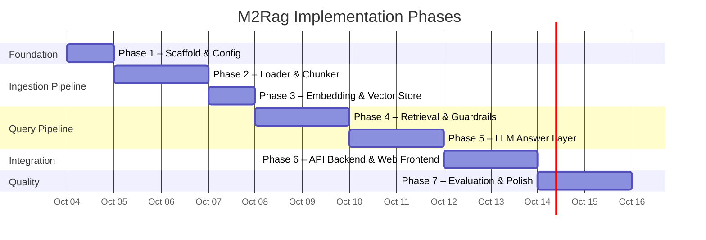
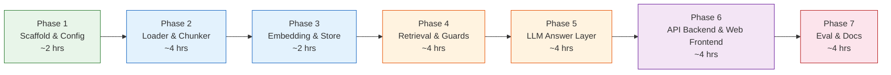

# Implementation Plan — Dietary Guidance RAG Chatbot

> **Project:** M2Rag — Milestone 2  
> **Goal:** A grounded, citation-bearing RAG chatbot over 7 dietary guidance documents  
> **Generated:** 2026-10-03

---

## Phase Map



---

## Phase 1 — Project Scaffold & Configuration

**Goal:** Set up the directory skeleton, install dependencies, and centralise all tuneable parameters so every later phase just fills in module bodies.

### Tasks

| # | Task | File(s) | Notes |
|---|------|---------|-------|
| 1.1 | Create full directory tree matching architecture §7 | `src/`, `eval/`, `tests/` dirs + `__init__.py` stubs | Every package must have `__init__.py` |
| 1.2 | Write `requirements.txt` | `requirements.txt` | Pin versions: `sentence-transformers`, `chromadb`, `google-genai`, `pytest` |
| 1.3 | Create `config.py` with all tuneable constants | `src/config.py` | Copy defaults from architecture §9 verbatim |
| 1.4 | Create `document_metadata.py` | `src/document_metadata.py` | The `DOCUMENT_METADATA` dict from architecture §2.3 |
| 1.5 | Create a Python virtual environment & install deps | — | `python -m venv .venv && pip install -r requirements.txt` |
| 1.6 | Verify imports work | — | `python -c "from src.config import *; print('OK')"` |

### Deliverables

```
M2Rag/
├── blocks.jsonl
├── README.md
├── Docs/
│   ├── problemStatement.md
│   ├── architecture.md
│   ├── deployment-plan.md
│   └── implementation.md
├── requirements.txt
├── src/
│   ├── __init__.py
│   ├── config.py
│   ├── document_metadata.py
│   ├── ingestion/
│   │   └── __init__.py
│   ├── retrieval/
│   │   └── __init__.py
│   ├── guardrails/
│   │   └── __init__.py
│   ├── generation/
│   │   └── __init__.py
│   ├── api/
│   │   └── __init__.py
│   └── static/
│       ├── index.html
│       ├── style.css
│       └── app.js
├── eval/
│   └── results/
└── tests/
```

### Acceptance Criteria

- [ ] `pip install -r requirements.txt` succeeds with no errors
- [ ] `from src.config import TOP_K, EMBEDDING_MODEL` works
- [ ] `from src.document_metadata import DOCUMENT_METADATA` returns 7 entries

---

## Phase 2 — Loader & Semantic Chunker

**Goal:** Read `blocks.jsonl` into typed objects, then produce semantically coherent chunks with full metadata attached.

### Dependencies

- Phase 1 complete (config, metadata registry)

### Tasks

| # | Task | File(s) | Notes |
|---|------|---------|-------|
| 2.1 | Define `Block` dataclass | `src/ingestion/loader.py` | Fields: `document_id`, `ordinal`, `type`, `text`, `heading_path`, `level` |
| 2.2 | Implement `load_blocks(path) → list[Block]` | `src/ingestion/loader.py` | Read JSONL line-by-line; validate schema; group by `document_id` |
| 2.3 | Define `Chunk` dataclass | `src/ingestion/chunker.py` | Fields: `chunk_id`, `document_id`, `section_heading`, `heading_path`, `text`, `block_types`, `ordinal_range`, `char_count`, `metadata` |
| 2.4 | Implement semantic chunking algorithm | `src/ingestion/chunker.py` | Follow architecture §3.2 exactly — heading-boundary splits, table isolation, merge undersized, cap oversized |
| 2.5 | Wire `DOCUMENT_METADATA` into chunk metadata | `src/ingestion/chunker.py` | Every chunk gets `title`, `publisher`, `year`, `url` from the registry |
| 2.6 | Write unit tests for the chunker | `tests/test_chunker.py` | See test cases below |

### Key Algorithm — `chunk_document(blocks: list[Block]) → list[Chunk]`

```
for each document_id:
    1. Sort blocks by ordinal
    2. Walk blocks:
       - HEADING block → start new chunk (level-1 always; lower levels only if current chunk ≥ MIN_CHUNK_CHARS)
       - TABLE block → flush current chunk; emit table as standalone chunk
       - PARAGRAPH / LIST_ITEM → append to current chunk
    3. After walk: flush remaining buffer
    4. Merge pass: if chunk.char_count < MIN_CHUNK_CHARS, merge into next chunk
    5. Split pass: if chunk.char_count > MAX_CHUNK_CHARS, split at paragraph boundaries
    6. Assign chunk_id = f"{document_id}__{section_heading_slug}__{seq:03d}"
```

### Test Cases (`test_chunker.py`)

| Test | What it checks |
|------|----------------|
| `test_heading_starts_new_chunk` | A level-1 heading always creates a new chunk boundary |
| `test_table_stays_intact` | A table block is never split across two chunks |
| `test_small_chunks_merged` | Chunks under 100 chars get merged into their neighbour |
| `test_large_chunks_split` | Chunks over 1500 chars get split at paragraph boundaries |
| `test_metadata_attached` | Every chunk has `metadata.publisher`, `metadata.year`, `metadata.url` |
| `test_all_blocks_consumed` | Total text across all chunks equals total text across all input blocks (no data loss) |

### Acceptance Criteria

- [ ] `load_blocks("blocks.jsonl")` returns exactly 1001 blocks across 7 documents
- [ ] Chunker produces chunks where **no chunk exceeds 1500 chars** and **no chunk is under 100 chars** (except edge cases)
- [ ] Tables are never split
- [ ] Every chunk carries full `metadata` dict
- [ ] All tests pass: `pytest tests/test_chunker.py -v`

---

## Phase 3 — Embedding & Vector Store

**Goal:** Embed every chunk and store it in ChromaDB with metadata, ready for retrieval.

### Dependencies

- Phase 2 complete (chunks with metadata)

### Tasks

| # | Task | File(s) | Notes |
|---|------|---------|-------|
| 3.1 | Configure ChromaDB Embedding Function | `src/ingestion/embedder.py` | Use `SentenceTransformerEmbeddingFunction` from `chromadb.utils` with `BAAI/bge-large-en-v1.5` |
| 3.2 | Create ChromaDB collection & Upsert | `src/ingestion/embedder.py` | Pass `embedding_function` to collection. Upsert documents, letting ChromaDB auto-embed texts |
| 3.3 | Write an ingestion entry-point script | `src/ingestion/__init__.py` or `ingest.py` (root) | `python -m src.ingestion` or `python ingest.py` runs the full pipeline: load → chunk → embed → store |
| 3.4 | Verify the index | — | Query the collection count; spot-check a few embeddings |

### Implementation Detail

```python
# embedder.py — core loop
import chromadb
from chromadb.utils import embedding_functions

def build_index(chunks: list[Chunk]) -> None:
    client = chromadb.PersistentClient(path=CHROMA_PERSIST_DIR)
    emb_fn = embedding_functions.SentenceTransformerEmbeddingFunction(model_name=EMBEDDING_MODEL)
    collection = client.get_or_create_collection(
        name=COLLECTION_NAME,
        embedding_function=emb_fn,
        metadata={"hnsw:space": DISTANCE_METRIC}
    )

    texts = [c.text for c in chunks]
    ids = [c.chunk_id for c in chunks]
    metadatas = [
        {
            "document_id": c.document_id,
            "section_heading": c.section_heading,
            "publisher": c.metadata.get("publisher", ""),
            "year": c.metadata.get("year", ""),
            "url": c.metadata.get("url", ""),
        }
        for c in chunks
    ]

    collection.upsert(documents=texts, ids=ids, metadatas=metadatas)
```

### Acceptance Criteria

- [ ] `python ingest.py` runs end-to-end without errors
- [ ] ChromaDB collection has the expected number of chunks (verify with `collection.count()`)
- [ ] Persisted DB directory (`./chroma_db/`) is created and non-empty
- [ ] Spot-check: query "chicken storage" returns chunks from `cold-food-storage` or `kitchen-companion`

---

## Phase 4 — Retrieval & Guardrails

**Goal:** Build the retriever (cross-corpus + filtered) and both refusal layers (out-of-scope guard + not-in-corpus check).

### Dependencies

- Phase 3 complete (populated vector store)

### Tasks

| # | Task | File(s) | Notes |
|---|------|---------|-------|
| 4.1 | Implement `Retriever` class | `src/retrieval/retriever.py` | Init ChromaDB client and `SentenceTransformerEmbeddingFunction` |
| 4.2 | Implement `search` using `query_texts` | `src/retrieval/retriever.py` | `collection.query(query_texts=[query])` for auto-embedding |
| 4.3 | Support single-document filtered search | `src/retrieval/retriever.py` | Use ChromaDB `where={"document_id": doc_id}` filtering |
| 4.4 | Implement `is_out_of_scope(query) → bool` | `src/guardrails/scope_guard.py` | Regex-based prohibited patterns from architecture §5.2 |
| 4.5 | Implement `check_relevance(results) → list[RetrievalResult]` | `src/guardrails/relevance_check.py` | Filter results below `SIMILARITY_THRESHOLD`; return empty list if none pass |
| 4.6 | Write unit tests for guardrails | `tests/test_guardrails.py` | See test cases below |
| 4.7 | Write unit tests for retriever | `tests/test_retriever.py` | See test cases below |

### Implementation Detail

```python
# retriever.py — query logic
import chromadb
from chromadb.utils import embedding_functions

class Retriever:
    def __init__(self):
        self.client = chromadb.PersistentClient(path=CHROMA_PERSIST_DIR)
        self.emb_fn = embedding_functions.SentenceTransformerEmbeddingFunction(model_name=EMBEDDING_MODEL)
        self.collection = self.client.get_collection(
            name=COLLECTION_NAME,
            embedding_function=self.emb_fn
        )

    def search(self, query: str, k: int = 5, document_id: str = None):
        where_clause = {"document_id": document_id} if document_id else None
        
        results = self.collection.query(
            query_texts=[query],
            n_results=k,
            where=where_clause,
            include=["documents", "metadatas", "distances"]
        )
        return results
```

### Test Cases — Guardrails (`test_guardrails.py`)

| Test | Input | Expected |
|------|-------|----------|
| `test_medical_blocked` | "Can you diagnose my rash?" | `is_out_of_scope → True` |
| `test_calorie_blocked` | "How many calories should I eat daily?" | `is_out_of_scope → True` |
| `test_weight_blocked` | "What's a good BMI for my age?" | `is_out_of_scope → True` |
| `test_valid_diet_question` | "What does WHO say about salt intake?" | `is_out_of_scope → False` |
| `test_valid_storage_question` | "How long can I keep beef in the fridge?" | `is_out_of_scope → False` |

### Test Cases — Retriever (`test_retriever.py`)

| Test | What it checks |
|------|----------------|
| `test_cross_corpus_returns_results` | Unfiltered search returns results from multiple documents |
| `test_filtered_returns_only_target_doc` | Filtered search only returns chunks from the specified `document_id` |
| `test_irrelevant_query_low_scores` | A totally off-topic query (e.g., "history of ancient Rome") returns scores below threshold |

### Acceptance Criteria

- [ ] Scope guard blocks medical, calorie, and weight queries
- [ ] Scope guard passes legitimate dietary/food-safety questions
- [ ] Cross-corpus search returns results from ≥2 documents for broad questions
- [ ] Filtered search returns results from exactly 1 document
- [ ] Relevance check filters low-score results correctly
- [ ] All tests pass: `pytest tests/test_guardrails.py tests/test_retriever.py -v`

---

## Phase 5 — LLM Answer Layer

**Goal:** Build the prompt, call the LLM, and produce cited answers that never blend sources.

### Dependencies

- Phase 4 complete (retriever + guardrails)

### Tasks

| # | Task | File(s) | Notes |
|---|------|---------|-------|
| 5.1 | Implement `build_prompt(query, chunks) → str` | `src/generation/prompt_builder.py` | System prompt from architecture §6.1; format retrieved chunks with full metadata |
| 5.2 | Implement `generate_answer(prompt) → str` | `src/generation/answer_generator.py` | Call Groq via `groq` SDK; configure temperature=0.1, max_tokens from config |
| 5.3 | Format chunks for prompt insertion | `src/generation/prompt_builder.py` | Each chunk block: `[Source: {title} ({publisher}, {year})] Section: {heading}\n{text}` |
| 5.4 | Handle cross-document answer separation | `src/generation/prompt_builder.py` | Prompt instructions ensure LLM answers per-document with separate citations |
| 5.5 | Write citation format tests | `tests/test_citations.py` | See test cases below |

### Prompt Template

```
You are a dietary guidance assistant. You answer ONLY from the provided
source chunks. You NEVER use your own knowledge.

RULES:
1. Every claim must include a citation: [Document Title, Publisher, Year](URL)
2. If multiple documents address the question, answer from EACH document
   separately with its own citation. Never blend sources.
3. If the chunks don't contain the answer, say so and list the documents
   you searched.
4. Keep answers at the population level. Never make personal recommendations.
5. Never provide calorie targets, weight targets, or medical advice.

CHUNKS:
---
[Source: {chunk.metadata.title} ({chunk.metadata.publisher}, {chunk.metadata.year})]
Section: {chunk.section_heading}
{chunk.text}
URL: {chunk.metadata.url}
---
(... repeated for each retrieved chunk ...)

USER QUESTION:
{user_query}
```

### Test Cases (`test_citations.py`)

| Test | What it checks |
|------|----------------|
| `test_answer_contains_citation` | Response includes at least one `[Title, Publisher, Year](URL)` pattern |
| `test_multi_doc_answer_has_separate_citations` | For a cross-document question, response contains citations from ≥2 different documents |
| `test_refusal_when_no_relevant_chunks` | When relevance check returns empty, response includes "don't appear to cover" and lists document names |
| `test_no_blended_claims` | Answer never attributes a single claim to multiple sources simultaneously |

### Acceptance Criteria

- [ ] Single-doc question → answer with one citation from the correct document
- [ ] Cross-doc question (e.g., about cooking oils) → separate cited paragraphs per source
- [ ] No-relevant-chunks scenario → polite refusal naming the documents searched
- [ ] All citations follow `[Title, Publisher, Year](URL)` format
- [ ] LLM temperature is 0.1 (factual grounding)
- [ ] All tests pass: `pytest tests/test_citations.py -v`

---

## Phase 6 — API Backend & Web Frontend

**Goal:** Wire all components into a single orchestration pipeline and expose it via a FastAPI backend and a static HTML/JS frontend.

### Dependencies

- Phases 4 and 5 complete (retrieval + generation)
- Update `requirements.txt` to include `fastapi` and `uvicorn`.

### Tasks

| # | Task | File(s) | Notes |
|---|------|---------|-------|
| 6.1 | Implement `ask(query) → str` orchestration logic | `src/api/routes.py` | Full pipeline: scope guard → embed query → retrieve → relevance check → generate or refuse |
| 6.2 | Handle all three response paths | `src/api/routes.py` | ① Out-of-scope refusal ② Not-in-corpus refusal ③ Cited answer |
| 6.3 | Build FastAPI app and endpoints | `main.py` (root) | Setup FastAPI, mount static files, and create `/chat` endpoint |
| 6.4 | Implement Frontend Structure | `src/static/index.html` | Chat UI layout |
| 6.5 | Implement Frontend Styling | `src/static/style.css` | Modern design with CSS (glassmorphism, clean typography) |
| 6.6 | Implement Frontend Logic | `src/static/app.js` | Send query to `/chat` and display response |

### Orchestration Flow

```python
# Inside src/api/routes.py
def process_query(query: str) -> str:
    # Step 1: Out-of-scope check
    if scope_guard.is_out_of_scope(query):
        return REFUSAL_OUT_OF_SCOPE

    # Step 2: Retrieve
    results = retriever.search(query, k=TOP_K)

    # Step 3: Relevance check
    relevant = relevance_checker.filter(results)
    if not relevant:
        doc_names = list(DOCUMENT_METADATA.keys())
        return REFUSAL_NOT_IN_CORPUS.format(documents=doc_names)

    # Step 4: Generate
    prompt = prompt_builder.build(query, relevant)
    return answer_generator.generate(prompt)
```

### Acceptance Criteria

- [ ] `uvicorn main:app --reload` launches a working web server
- [ ] Frontend successfully communicates with `/chat` API
- [ ] Out-of-scope queries produce the correct refusal template
- [ ] Off-topic queries produce the not-in-corpus refusal with document names
- [ ] Valid queries produce cited answers
- [ ] Frontend uses modern, rich aesthetics

---

## Phase 7 — Evaluation, Testing & Documentation

**Goal:** Build the evaluation harness, run all assessments, and write the README.

### Dependencies

- Phase 6 complete (working end-to-end chatbot)

### Tasks

| # | Task | File(s) | Notes |
|---|------|---------|-------|
| 7.1 | Create the question bank | `eval/question_bank.json` | 15+ questions, each with `query`, `expected_document_ids`, `expected_section`, `type` (factual / cross-doc / refusal / out-of-scope) |
| 7.2 | Implement automated retrieval eval | `eval/run_eval.py` | For each question: run retrieval, check if expected doc/section is in top-k, compute hit rate |
| 7.3 | Implement refusal eval | `eval/run_eval.py` | For out-of-scope and not-in-corpus questions, verify the correct refusal path fires |
| 7.4 | Implement citation spot-check | `eval/run_eval.py` | For 10 factual questions, verify citation format is present |
| 7.5 | Run full eval, save results | `eval/results/` | Generate a results JSON/markdown report |
| 7.6 | Write README.md | `README.md` | Setup instructions, chunking rationale, architecture overview, eval results |
| 7.7 | Final test sweep | — | `pytest tests/ -v --tb=short` |

### Question Bank Structure (`eval/question_bank.json`)

```json
[
  {
    "id": "q01",
    "query": "How long can raw chicken be stored in the fridge?",
    "type": "factual",
    "expected_document_ids": ["cold-food-storage", "kitchen-companion"],
    "expected_section_keywords": ["chicken", "storage", "refrigerat"]
  },
  {
    "id": "q02",
    "query": "What does WHO recommend about salt intake?",
    "type": "factual",
    "expected_document_ids": ["who-healthy-diet"],
    "expected_section_keywords": ["salt", "sodium"]
  },
  {
    "id": "q03",
    "query": "What are the guidelines on cooking oil safety vs nutrition?",
    "type": "cross-document",
    "expected_document_ids": ["eatwell-guide", "kitchen-companion"],
    "expected_section_keywords": ["oil", "fat"]
  },
  {
    "id": "q04",
    "query": "Can you prescribe medication for my stomach ache?",
    "type": "out-of-scope",
    "expected_response": "refusal_out_of_scope"
  },
  {
    "id": "q05",
    "query": "What's a good diet for my pet parrot?",
    "type": "not-in-corpus",
    "expected_response": "refusal_not_in_corpus"
  }
]
```

### Evaluation Targets (from architecture §10)

| Metric | Target |
|--------|--------|
| Retrieval hit rate (correct doc in top-k) | ≥ 80% |
| Per-document filter accuracy | 100% |
| Out-of-scope refusal accuracy | 100% |
| Not-in-corpus refusal accuracy | 100% |
| Citation format correctness (spot-check) | 10/10 |

### Acceptance Criteria

- [ ] Question bank has ≥15 questions covering all 4 types
- [ ] Retrieval hit rate ≥ 80%
- [ ] All refusal tests pass
- [ ] Citation spot-checks all pass
- [ ] README.md documents setup, chunking decisions, and eval results
- [ ] `pytest tests/ -v` — all green

---

## Summary — Phase Dependencies & Estimated Effort



| Phase | Estimated Time | Key Risk |
|-------|---------------|----------|
| 1 — Scaffold & Config | ~2 hours | Low — boilerplate |
| 2 — Loader & Chunker | ~4 hours | **Medium** — chunking algorithm edge cases (tables, tiny blocks) |
| 3 — Embedding & Vector Store | ~2 hours | Low — straightforward with sentence-transformers + ChromaDB |
| 4 — Retrieval & Guardrails | ~4 hours | **Medium** — tuning similarity threshold; regex coverage |
| 5 — LLM Answer Layer | ~4 hours | **Medium** — prompt engineering for citation format compliance |
| 6 — API Backend & Web Frontend | ~4 hours | **Medium** — wiring components and building UI |
| 7 — Evaluation & Polish | ~4 hours | **Medium** — building comprehensive question bank |
| **Total** | **~22 hours** | |

---

## Quick Reference — File → Phase Mapping

| File | Phase | Purpose |
|------|-------|---------|
| `requirements.txt` | 1 | Dependencies |
| `src/config.py` | 1 | All tuneable parameters |
| `src/document_metadata.py` | 1 | Publisher/year/URL registry |
| `src/ingestion/loader.py` | 2 | Read `blocks.jsonl` |
| `src/ingestion/chunker.py` | 2 | Semantic section chunking |
| `src/ingestion/embedder.py` | 3 | Embed + store in ChromaDB |
| `src/retrieval/retriever.py` | 4 | Vector search (cross-corpus + filtered) |
| `src/guardrails/scope_guard.py` | 4 | Out-of-scope regex check |
| `src/guardrails/relevance_check.py` | 4 | Post-retrieval score filtering |
| `src/generation/prompt_builder.py` | 5 | Build grounded prompts |
| `src/generation/answer_generator.py` | 5 | LLM call + response |
| `src/api/routes.py` | 6 | Full pipeline orchestrator |
| `main.py` | 6 | FastAPI app entry point |
| `src/static/*` | 6 | Frontend HTML/CSS/JS |
| `eval/question_bank.json` | 7 | Test questions |
| `eval/run_eval.py` | 7 | Automated evaluation |
| `README.md` | 7 | Documentation |
| `tests/test_chunker.py` | 2 | Chunker unit tests |
| `tests/test_guardrails.py` | 4 | Guardrail unit tests |
| `tests/test_retriever.py` | 4 | Retriever unit tests |
| `tests/test_citations.py` | 5 | Citation format tests |
